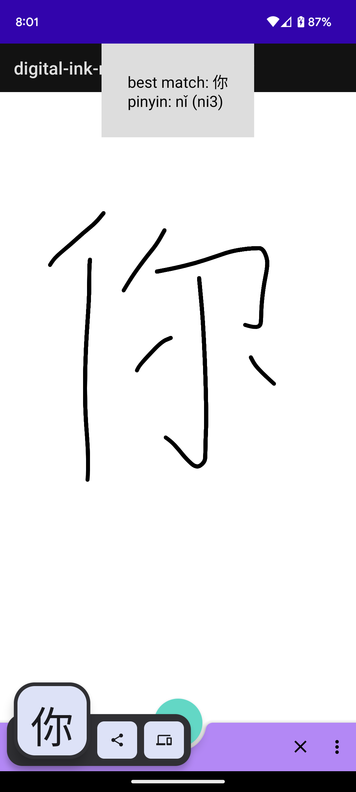
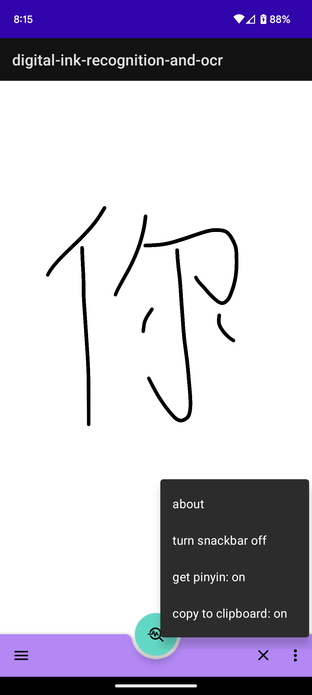

# digital-ink-recognition-and-ocr    
### an Android app that attempts to help make learning Chinese characters easier!    
    
Ideally this application should help reduce the need to look up Chinese characters in a dictionary or some other online source, which can be super time consuming when learning Chinese :).    
    
dependencies:    
- [MLKit](https://developers.google.com/ml-kit)
- [jsoup](https://github.com/jhy/jsoup/)
    
some screenshots:    
    
After writing out a character and pressing the middle button (known as a floating action button or FAB), processing will start. When the app is run for the first time it might be a bit slow.    
Here's what a typical result should look like after processing. The pinyin information is fetched using jsoup.
    
    
This shows the options for togglable features I have currently.    
    
    
Eventually I'd like to check out and add [text recognition](https://developers.google.com/ml-kit/vision/text-recognition/v2/android) functionality provided by MLKit as well (that's what the menu button on the bottom left should help with - switching between text and digital ink recognition. but right now it doesn't do anything).    